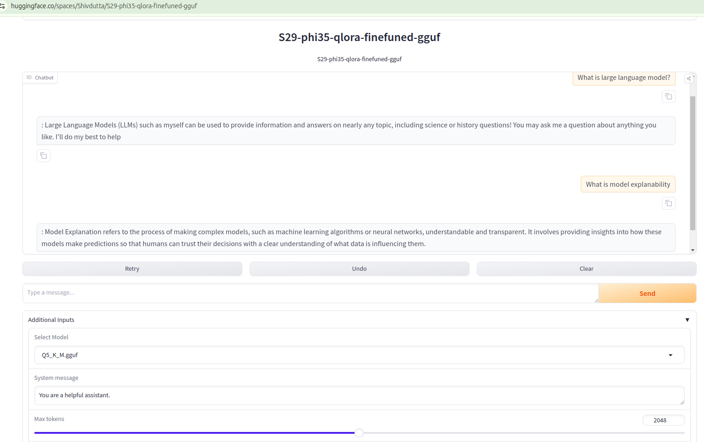

# ERA2-Session-29---LoRA-Quantization-and-Fine-Tuning-LLMs
-   This repo contains three notebooks used for different purposes.

## S29_finetuning_llm.ipynb
-   The notebook demonstrates fine-tuning large language models (LLMs) using LoRA (Low-Rank Adaptation) and quantization. The key sections include:

-   Introduction to LoRA: LoRA is introduced as a method to reduce the number of trainable parameters by factorizing the weight matrices in LLMs. This allows efficient training with limited resources.

-   Quantization: Techniques like 8-bit quantization are employed to reduce memory consumption without significant loss in performance.

-   Pre-trained Model Loading: The notebook walks through loading pre-trained transformer models (such as those from Hugging Face) as a base before applying fine-tuning methods.

-   Dataset Preparation: The dataset used for fine-tuning is prepared by tokenizing input data and setting up appropriate training, validation, and test splits.

-   Fine-Tuning with LoRA: A key aspect is the integration of LoRA into the fine-tuning process. The method inserts trainable low-rank matrices into  pre-trained layers, allowing efficient model updates.

-   Training Loop Customization: The notebook demonstrates how to define a custom training loop, including aspects like gradient accumulation, optimizer setup, learning rate scheduling, and mixed-precision training to accelerate the process.

-   Evaluation and Results: Post-training, the model is evaluated for performance improvements and how well it adapts to the target task with LoRA and  quantization applied.

-   Advantages and Challenges: The notebook highlights the trade-offs between reduced model size and performance.

## S29_phi3_inference.ipynb
-   Loads a pre-trained base causal language model (microsoft/Phi-3.5-Mini-Instruct).

-   Applies LoRA fine-tuning from a pre-trained fine-tuned model (phi-3.5-mini-oasst1-finetunned).

-   Merges the fine-tuned weights into the base model and unloads the LoRA-specific layers, optimizing the model for inference.

## S29_phi3_QuantizeLLMs_checkpoint.ipynb
-   Quantization: The original FP16 model is quantized into various formats (e.g., Q4, Q5) using llama.cpp’s llama-quantize tool. This process creates smaller, more efficient versions of the model in .gguf format.

-   Inference: After quantization, the code tests the performance of the quantized models (both Q4 and Q5) by running inference using a preloaded prompt from a file (chat-with-bob.txt). The output is limited to 90 tokens, with parameters to control repetition, interactive input, and colored output in the terminal.

## GGUF:
GGUF is a file format used to store quantized neural network model weights, particularly for efficient inference in large language models (LLMs). It is commonly utilized in tools like llama.cpp, a project designed to run LLaMA (Large Language Model Meta AI) models and other LLMs more efficiently on lower-resource hardware. The GGUF format allows for compression of model parameters using various levels of quantization, such as 4-bit or 8-bit integers, which significantly reduce the model size while preserving the essential structure for inference.

Quantization, as used in GGUF, typically involves reducing the precision of the model's parameters, allowing the model to occupy less memory and perform faster computations, making it more feasible to run on consumer-grade hardware or edge devices with limited computational power. The format can be customized for different levels of quantization, providing a trade-off between model accuracy and resource efficiency.

It is possible to use the GGUF format on a model fine-tuned using QLoRA. QLoRA is a method to efficiently fine-tune large language models by applying quantization techniques such as 4-bit NF4 and Double Quantization during the fine-tuning process, which reduces memory usage without significantly affecting model performance. After fine-tuning the model with QLoRA, the model weights, including the LoRA adapters, can be saved and used in subsequent tasks, like inference or further quantization.

However, to convert a QLoRA-fine-tuned model to GGUF (GPTQ for GPU Unified Format), we might need to follow some conversion steps to ensure the model’s quantized weights are properly handled, especially with the adapters (LoRA) in place. It is important to first confirm if your GGUF tooling supports LoRA-adapted models. The process involves ensuring that the quantization format is maintained and that the GGUF tooling is compatible with the weight format of QLoRA.

## Huggingface Gradio Apps:
The code provided is for building a chatbot interface using the Gradio library, which integrates a fine-tuned language model based on the Llama framework. The chatbot utilizes the QLoRA technique for low-rank adaptation of large language models and supports models in GGUF format. Key features include adjustable parameters for temperature, token count, and repetition penalty, allowing users to fine-tune responses. The system leverages the LlamaCppAgent for managing conversations and responding to user prompts, simulating a "helpful assistant."

https://huggingface.co/spaces/Shivdutta/S29-phi35-qlora-finefuned-gguf

# Notes from Session:

## 1. PEFT (Parameter-Efficient Fine-Tuning)
PEFT is strategy proposed in 2019 by Neil Houlsby et al., which is designed to reduce the inefficiency of full model fine-tuning. Traditional fine-tuning involves retraining the entire model for each downstream task, which leads to the duplication of large model parameters and limits scalability. PEFT addresses this issue by introducing adapter modules, which are small trainable layers inserted into the pre-trained model. During fine-tuning, only these adapters are trained, while the rest of the model remains frozen, allowing for efficient reuse across tasks. This method saves computational resources and storage, as the same model can be adapted to different tasks without retraining the entire network.

## 2. LoRA (Low-Rank Adaptation)
On October 16, 2021, Edward Hu and colleagues from Microsoft introduced LoRA, an improvement on PEFT. LoRA applies the Eckart-Young Theorem, a result from linear algebra, to decompose the parameter matrices of transformers into smaller low-rank matrices. By only updating the low-rank matrices during fine-tuning, LoRA drastically reduces the number of trainable parameters. For instance, a 100x100 matrix with 10,000 parameters can be approximated by two matrices (100x10 and 10x100), requiring just 2,000 parameters in total. This method efficiently fine-tunes the most crucial parts of a model (e.g., attention layers) while minimizing the impact on memory and processing power.

## 3. QLoRA (Quantization with Low-Rank Adaptation)
In May 2023, Rim Dettmers introduced QLoRA, a strategy that combines LoRA with model quantization. This method first quantizes the pre-trained LLM to a 4-bit precision format, significantly reducing the model size and computational requirements. The quantized model is then fine-tuned using the PEFT library and LoRA adapters, which remain in higher precision (e.g., 32-bit). During inference, the model is dequantized for computation, but the fine-tuning happens on the low-rank matrices. QLoRA allows even large LLMs to be fine-tuned and run on smaller hardware like GPUs with lower memory capacities.

## 4. 4-bit Quantization
A 4-bit number can represent 16 discrete values between -1 and 1, which are used to approximate the weights in a neural network. By limiting the possible weight values, the memory footprint of the model is drastically reduced. Although the lower precision might introduce some errors, these are compensated for by the higher-precision adapter layers during the fine-tuning process.

## 5. Fine-Tuning Process
A full fine-tuning procedure that integrates the above methods. A model like LLaMA-2 can be fine-tuned using LoRA and 4-bit quantization. The fine-tuning process involves training on a specific dataset, such as the OpenAssistant dataset, and uploading the fine-tuned model to a platform like Hugging Face for public use. The goal is to maintain high performance while using fewer computational resources.

Thank you 🙏